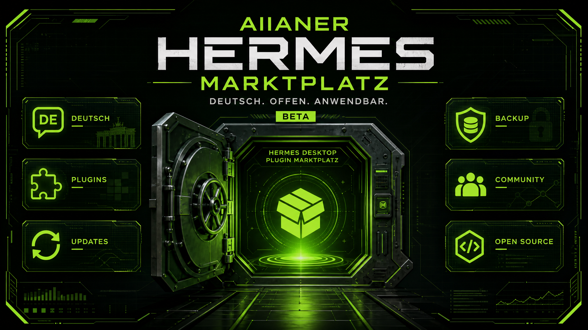

<h1 align="center">🇩🇪 AIIANER Hermes Extensions</h1>

<p align="center"><strong>Der deutsche Marktplatz für Hermes Desktop.</strong><br />
Installierbare Werkzeuge, Sprache und Automationen für deinen KI-Außenposten.</p>

<p align="center">
  <a href="#status"></a>
  <a href="#lizenz"></a>
  
  <a href="https://aiianer.de"></a>
</p>



> **🚧 BETA:** Der AIIANER Hermes Marktplatz ist aktiv nutzbar, aber noch in Entwicklung. Teste ihn gern — und melde Fehler, Ideen oder UX-Stolpersteine über [Feedback & Issues](https://github.com/oliverhees/aiianer-hermes-extensions/issues/new/choose).

---

## Was ist das?

Der **AIIANER Hermes Marktplatz** ist die deutsche Erweiterungsplattform für
[Hermes Desktop](https://github.com/NousResearch/hermes-agent). Ein Plugin, ein
klarer Ort, ein Klick: deutsche Sprache, nützliche Werkzeuge und update-feste
Automationen direkt in Hermes.

**Tagline:** KI zum Anwenden, nicht zum Hypen.

Der Marktplatz ist ein **Hybrid-Plugin** für Hermes: Agent-Backend und
Desktop-Oberfläche gehören zusammen. Das Backend stellt die Installations-,
Update- und Backup-API bereit; die Desktop-Hälfte liefert die Bedienoberfläche.
Über diese Oberfläche installierst und aktualisierst du die übrigen AIIANER-
Erweiterungen.

## Komponenten

| Komponente | Was sie tut |
| --- | --- |
| **aiianer-hub** | **Der Marktplatz.** Ein Reiter in Hermes zum Installieren und Aktualisieren der AIIANER-Erweiterungen. Enthält außerdem den Wächter, der die Erweiterungen nach Hermes-Updates prüft und bei Bedarf repariert. |
| **eurouter-provider** | EU Router als Provider mit EU-Compliance-Routen im Modell-Picker. |
| **german-language** | Deutsche Oberfläche für Hermes Desktop. Wird nach Hermes-Updates automatisch erneut eingespielt. |
| **bot-mode-german** | Deutsche Texte für Bot Mode: Liste, Gruppenchats, Avatare und Zeitpläne. Setzt `german-language` voraus. |
| **group-chat-limits** | Eigene Runden-, Nachrichten-, Fortsetzungs- und Verlaufsgrenzen pro Gruppenchat. |
| **aiianer-backup** | Lokale vollständige Hermes-Backups in einem externen Ordner. V1 mit Planung, Laufprotokoll, Archivliste und sicherem Restore. GitHub-Backup steht auf der Roadmap. |

## EUrouter.ai

Für EU-basierte Modellrouten gibt es im Marktplatz die Erweiterung **EU-Router**. Mehr über EUrouter.ai: [eurouter.ai](https://www.eurouter.ai?ref=06ZUHPBK) **(Affiliate-Link)**.

## Installation

Der **einzige Installationsweg** führt über Hermes selbst:

1. Öffne in Hermes **Settings → Plugins → Install from Git**.
2. Trage dieses Repository ein:

   ```text
   https://github.com/oliverhees/aiianer-hermes-extensions
   ```

3. Prüfe die angezeigten Plugin-Inhalte und installiere das Plugin.
4. Aktiviere **AIIANER** anschließend, falls Hermes danach fragt, und beende Hermes vollständig. Starte Hermes danach komplett neu.

Das Repo enthält `plugin.yaml` im Root sowie die Agent-, Desktop- und
Backend-Hälfte. Hermes erkennt es deshalb als Hybrid-Plugin. Der Agent-Teil ist
für das Backend erforderlich; ohne ihn sind Katalog, Installation, Updates und
Backup im Desktop nicht verfügbar.

Nach dem Neustart erscheint **AIIANER** in der Seitenleiste beziehungsweise als
Dashboard-Reiter. Die weiteren Komponenten installierst du dort mit den jeweiligen
Buttons.

### Windows

Windows ist ein gleichwertiger Weg – seit 1.3.33 auch beim Installieren. Der
Marktplatz spielt „Deutsche Sprache“, „Bot-Modus auf Deutsch“,
„Gruppenchat-Grenzen“ und „AIIANER Backup“ dort nativ mit dem Python ein, das
Hermes ohnehin mitbringt. Eine Bash (Git-Bash, MSYS2, WSL) ist dafür **nicht**
nötig.

Kommst du von 1.3.32 oder älter und die Installation endete mit
`/bin/bash: C:\Users\...\install.sh: No such file or directory`: zuerst im
Marktplatz den **AIIANER EXTENSION HUB** aktualisieren, danach die gewünschte
Komponente. Das Hub-Update selbst war von dem Fehler nicht betroffen.

Seit 1.3.34 gilt das auch für den **EU-Router**: der Marktplatz baut die
Schritte seines Installers nativ nach, statt sein Shell-Skript auszuführen. Auf
Linux und macOS läuft weiterhin das Original-Skript aus dem EU-Router-Repo.

Sollte künftig eine Komponente doch einmal eine Bash brauchen, sagt der
Marktplatz das **vorher** und nennt
[Git for Windows](https://git-scm.com/download/win) als Abhilfe, statt beim
Klick in einen Fehler zu laufen.

## Update und Entfernen

Nach jeder Installation, jedem Update und jeder Deinstallation Hermes **vollständig beenden und neu starten**. Ein Gateway-Neustart oder ein Plugin-Reload reicht für die sichtbare Desktop-Oberfläche nicht zuverlässig aus.

Git-installierte Plugins verwaltest du in Hermes unter **Settings → Plugins**.
Dort kannst du das Plugin aktualisieren, deaktivieren oder entfernen. Der
Marktplatz kann sich nicht über seine eigene Oberfläche deinstallieren; nutze dafür
den normalen Plugin-Manager von Hermes.

## Update-Sicherheit

Hermes aktualisiert sein eigenes Programmverzeichnis regelmäßig. Der Marktplatz
liegt deshalb vollständig in den vorgesehenen Plugin-Verzeichnissen außerhalb des
Hermes-Checkouts. Die deutsche Sprachdatei und andere notwendige Anpassungen
werden über den Wächter nach einem Hermes-Update erneut eingespielt.

Der Wächter arbeitet mit Sicherungen und wiederholbaren Ankern. Wenn ein Hermes-
Umbau einen Ankerpunkt unbrauchbar macht, meldet der Marktplatz die Ursache,
statt still einen halben Zustand zu hinterlassen.

Ein täglicher, automatischer Trockenlauf testet die Anker zusätzlich gegen den
aktuellen Quellcode von `NousResearch/hermes-agent`, bevor irgendjemand ein
Update installiert. Findet er einen gerissenen Anker, öffnet er von selbst ein
Issue in diesem Repo.

**Wichtig zu wissen, wie die Sprachdatei überhaupt wirksam wird:** diese
Erweiterung lädt kein Deutsch zur Laufzeit nach, sie verändert Hermes'
Quellcode. Aus verändertem Quellcode muss erst wieder eine fertige Desktop-App
gebaut werden, sonst zeigt die bereits laufende (oder die als Programm-Symbol
gestartete) App weiterhin den alten Stand, egal wie oft man sie schließt und
wieder öffnet. Ein einfacher Neustart über das App-Symbol stößt diesen Neubau
für sich genommen nämlich nicht an, nur `hermes desktop` im Terminal tut das
von Haus aus.

Seit Version 1.3.36 übernimmt der Marktplatz diesen Neubau deshalb selbst:
Installation, Deinstallation und Reparatur lösen direkt `hermes desktop
--build-only` aus, das kann je nach Rechner eine bis wenige Minuten dauern
(daher der längere Ladezustand nach einem Klick). Ein normaler Neustart reicht
danach wirklich. Schlägt der automatische Neubau ausnahmsweise fehl, sagt der
Marktplatz das konkret und nennt als Rückfallweg: einmal `hermes desktop` in
einem Terminal ausführen.

### Falls Hermes Desktop nach der deutschen Sprachdatei nicht mehr aufgeht

Kommt vor, wenn Hermes selbst zwischenzeitlich seinen i18n-Ordner umgebaut hat
(Upstream-Drift) und der Neubau beim nächsten Start dabei scheitert. Ohne
laufende GUI ist weder der normale Weg (Deinstallieren im Marktplatz-Reiter)
noch der Hermes-Chat erreichbar, deshalb geht es hier nur direkt im Terminal:

1. Öffne ein Terminal (Windows: „Eingabeaufforderung" oder „PowerShell" im
   Startmenü suchen; macOS: „Terminal" über Spotlight/Launchpad; Linux: deine
   gewohnte Konsole).
2. Kopiere diese eine Zeile hinein und drücke Enter:

   ```bash
   curl -sL https://raw.githubusercontent.com/oliverhees/aiianer-hermes-extensions/main/extensions/german-language/restore-original.py | python3 -
   ```
3. Lies die Ausgabe durch, sie sagt dir, ob es geklappt hat.
4. Starte Hermes komplett neu (falls ein Gateway-Prozess separat läuft, auch
   den beenden und neu starten).

Das Skript setzt `types.ts`, `catalog.ts` und `languages.ts` auf den Stand vor
der Installation zurück, entfernt `de.ts` und den Build-Stempel, alles oder
nichts. Bitte danach in der AIIANER Community melden, mit der kompletten
Ausgabe des Skripts, das ist unser einziger Weg, den Anker rechtzeitig
nachzuziehen.

## Feedback, Hilfe und Probleme

Der Marktplatz ist **Beta**. Genau deshalb ist dein Feedback wichtig. Bevor du
ein Problem meldest, hilft ein Diagnose-Report enorm, er läuft auch, wenn die
Marktplatz-Oberfläche selbst das Problem ist. Kein Terminal nötig: Hermes ist
selbst ein Agent mit Terminal-Zugriff und macht das für dich. Kopiere diesen
Satz einfach in deinen Hermes-Chat:

> Bitte führe im Terminal den Befehl `python3 ~/.hermes/aiianer/guard_check.py
> diagnostics` aus und zeig mir das komplette Ergebnis, damit ich es in ein
> GitHub-Issue kopieren kann.

Hermes zeigt dir danach den Report direkt im Chat an. Er enthält installierte
Komponenten, den Health-Check, den Build-Stempel-Status und die letzten
Wächter-Log-Zeilen, nie Tokens, Passwörter oder Datei-Inhalte. Den Text
einfach unten ins Issue kopieren.

<details>
<summary>Lieber selbst im Terminal? So geht's auch direkt.</summary>

1. Öffne ein Terminal (Windows: „Eingabeaufforderung" oder „PowerShell" im
   Startmenü suchen; macOS: „Terminal" über Spotlight/Launchpad; Linux: deine
   gewohnte Konsole).
2. Kopiere diese eine Zeile hinein und drücke Enter:

   ```bash
   python3 ~/.hermes/aiianer/guard_check.py diagnostics
   ```
3. Markiere die komplette Ausgabe, kopiere sie (Strg/Cmd+C) und füge sie unten
   ins Issue ein (Strg/Cmd+V).

</details>

- 🐛 [Problem melden](https://github.com/oliverhees/aiianer-hermes-extensions/issues/new?template=bug_report.md)
- 💡 [Feature oder Idee vorschlagen](https://github.com/oliverhees/aiianer-hermes-extensions/issues/new?template=feature_request.md)
- 💬 [Allgemeines Feedback geben](https://github.com/oliverhees/aiianer-hermes-extensions/issues/new?template=feedback.md)
- 🔒 Sicherheitslücken bitte ausschließlich an **hi@aiianer.de** melden — siehe [SECURITY.md](SECURITY.md)

Fragen und Support: **[hi@aiianer.de](mailto:hi@aiianer.de)** oder in der [AIIANER Community](https://aiianer.de).

## Lizenz

AIIANER Hermes Extensions folgt einem **Open-Core-Modell**: Die Basis steht unter
**MIT** (siehe [LICENSE](LICENSE)) und ist für private wie kommerzielle Nutzung
frei. Details stehen in [LICENSING.md](LICENSING.md).

## Sicherheit

Sicherheitslücken bitte **nicht** als öffentliches Issue melden, siehe
[SECURITY.md](SECURITY.md).

## Marken

„AIIANER", „Lokyy", „Lokyy Brain", „Datenschleuse" und „Sichtradar" sind
Kennzeichen von Oliver Hees aka Aiianer. Die Lizenz des Quellcodes gewährt keine
Rechte an diesen Namen oder Logos. Forks müssen unter eigenem Namen auftreten.

"Hermes" und "EU Router" sind Produkt- beziehungsweise Angebotsnamen der jeweiligen
Betreiber. Diese Erweiterungen sind unabhängige Community-Projekte.

## Status

**🚧 Beta — live nutzbar, aktiv weiterentwickelt.**

Der lokale Backup-Außenposten ist verfügbar. Die geplante GitHub-Integration für
verschlüsselte, versionierte Backup-Assets folgt als nächste Ausbaustufe und ist
noch nicht Bestandteil der aktuellen V1.

## Roadmap

- [x] Deutscher Hermes-Marktplatz mit Desktop- und Dashboard-Integration
- [x] Externe lokale Backups mit Zeitplan, Laufprotokoll und sicherem Restore
- [x] Feedback- und Issue-Prozess direkt über GitHub
- [ ] GitHub-Integration für verschlüsselte Backup-Assets mit Prüfsumme
- [ ] **AIIANER Datenschleuse** — PII-Schutz für KI-Anfragen, lokal und DSGVO-first
- [ ] **ADHS-Aufgabenplaner** — Fokus-Blöcke, kleinster nächster Schritt und Parkplatz
- [ ] **Backup beim Beenden von Hermes** — sichere Ausführung über einen offiziellen App-Shutdown-Hook
- [ ] Geprüfter AIIANER MCP-Werkzeugkasten und Community-Workflows

---

<p align="center">
  © 2026 <strong>Oliver Hees aka Aiianer</strong> ·
  <a href="https://aiianer.de">aiianer.de</a> ·
  Gebaut im AIIANER-Universum
</p>
